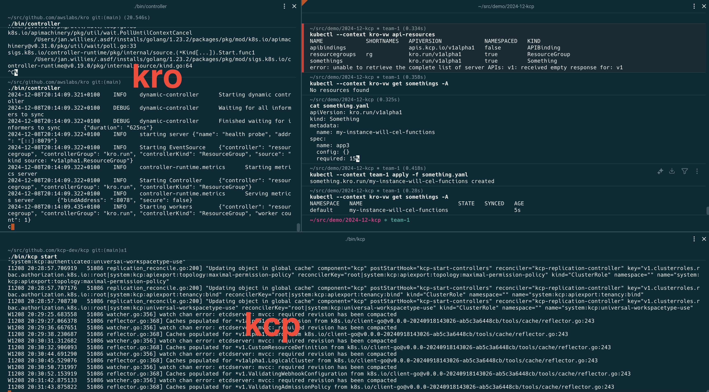

# kro as composition engine with kcp
[kcp](https://github.com/kcp-dev/kcp) is a webservice providing kubernetes apis as-a-service (by creating kcp workspaces). [kro](https://github.com/awslabs/kro) is a kubernetes composition engine which lets you define your own kubernetes apis. Let's connect the two.



## Goal
We want to create our own kubernetes api and make it available to teams within our company. Each team should have their own full kubernetes apiserver environment (e.g. their own CRDs, not just a namespace).

We set up two kcp organisations, one for provider teams and one for consumer teams. In each we create a respective team.

Then as provider team we prepare our own api ([a very simple one](https://github.com/awslabs/kro/blob/v0.1.0/examples/defaults/rg.yaml)) and publish it. 

Lastly as consumer team we bind the API and create an object for testing.

### Preparation
Since kro doesn't support [offline CRD generation](https://github.com/awslabs/kro/issues/163) yet, we first need to apply the `ResourceGroup` to a kube-apiserver and collect the CRD from there. I did that already and saved the result here:
- [kro.run_resourcegroups.yaml](kro.run_resourcegroups.yaml)
- [somethings.kro.run.crd.yaml](somethings.kro.run.crd.yaml)

Then I converted the CRDs to APIResourceSchemas:
```bash
# rg crd
kubectl kcp crd snapshot -f kro.run_resourcegroups.yaml --prefix v2024-12-07 > APIResourceSchema.resourcegroups.kro.run.yaml

# custom crd
kubectl kcp crd snapshot -f somethings.kro.run.crd.yaml --prefix v2024-12-07 > APIResourceSchema.somethings.kro.run.yaml
```
Now we are ready to start

### kcp
start kcp and set up our provider and consumer teams:
```bash
cd github.com/kcp-dev/kcp
./bin/kcp start
export KUBECONFIG=.kcp/admin.kubeconfig

# provider team
kubectl create workspace provider --enter
kubectl create workspace provider-team --enter
kubectl ws create-context provider-team

kubectl config use-context root
kubectl ws :root

# consumer team
kubectl create workspace consumer --enter
kubectl create workspace team-1 --enter
kubectl ws create-context team-1
```
 
Now as `provider-team` set up our APIs which we want to publish
```bash
# apply the APIResourceSchema (CRDs)
kubectl --context provider-team apply -f APIResourceSchema.somethings.kro.run.yaml
kubectl --context provider-team apply -f APIResourceSchema.resourcegroups.kro.run.yaml

# publish them
kubectl --context provider-team apply -f APIExport.somethings.kro.run.yaml
```
From the `APIExport` we get a dedicated kubernetes apiserver endpoint (a virtual workspace in kcp speak), which consists only of our resources. Let's have a look. First get the virtual workspace endpoint:
```bash
$ echo "`kubectl --context provider-team get -f APIExport.somethings.kro.run.yaml -o=jsonpath='{.status.virtualWorkspaces[0].url}'`/clusters/*"
https://192.168.0.136:6443/services/apiexport/128nz9url32dp92n/somethings.kro.run/clusters/*
```
Update your kubeconfig so that we can connect with `kubectl`. This is a bit manual:
```yaml
- cluster:
    certificate-authority-data: LS0tLS1CR[...]
    server: https://192.168.0.136:6443/services/apiexport/128nz9url32dp92n/somethings.kro.run/clusters/*
  name: kro-vw
- context:
    cluster: kro-vw
    user: kcp-admin
  name: kro-vw
```
Now we can inspect the endpoint:
```bash
$ kubectl --context kro-vw api-resources
NAME             SHORTNAMES   APIVERSION             NAMESPACED   KIND
apibindings                   apis.kcp.io/v1alpha1   false        APIBinding
resourcegroups   rg           kro.run/v1alpha1       true         ResourceGroup
somethings                    kro.run/v1alpha1       true         Something

$ kubectl --context kro-vw get somethings -A
No resources found
```
Ok! Nothing else to see except the things we want. In another terminal start `kro` and connect it to this endpoint:
```bash
cd github.com/awslabs/kro
export KUBECONFIG=/path/to/.kcp/admin.kubeconfig
kubectl config use-context kro-vw
./bin/controller
```
We are ready to let the API be consumed by a team:
```bash
# bind the API
kubectl --context team-1 apply -f APIBinding.somethings.kro.run.yaml

# use the API
kubectl --context team-1 apply -f something.yaml
```
That's it! We can see `kro` reconiling our kubernetes object and updating the spec.

There's a lot more to explore here, but that's for another post.